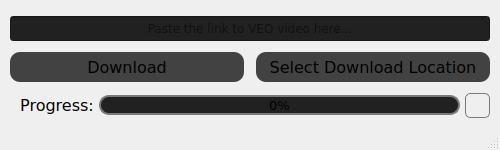
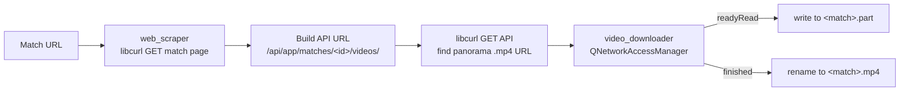

# Veo Downloader (C++ / Qt)

A native C++20 / Qt 6 desktop app that takes a Veo match URL and downloads the full match recording as an `.mp4`.


<!-- TODO: add docs/screenshot.png -->

> I built this app twice to compare the two languages: this C++/Qt version first, then [**veo-downloader-csharp**](https://github.com/amcnutt1996/veo-downloader-csharp) in C#/.NET (Jan – Feb 2026).

> **Note:** This tool is meant for downloading recordings you already have access to on Veo.

## What it does
- Paste an `app.veo.co/matches/...` link, and the app finds the underlying video file and downloads it.
- Shows live progress, saves to your Downloads folder by default, and lets you pick another folder.
- Cancel at any time with the Stop button or `Esc`. The partial file is cleaned up.
- Ships as a macOS `.app` bundle with its own icon, including a static Intel (x86_64) build made on Apple Silicon.

## Tech stack
C++20 · Qt 6 (Widgets, Network) · libcurl · CMake · vcpkg (manifest mode) · macOS app bundle

## How it works



- **Two-step link resolution** (`web_scraper.cpp`): Veo has no public download API. The scraper fetches the match page, pulls out the match ID to build the internal API URL, then searches that response for the `panorama/transcode` CDN link.
- **Async download with signals/slots** (`video_downloader.cpp`): `QNetworkReply`'s `readyRead`, `downloadProgress` and `finished` signals drive the file writes, the progress bar and cleanup, so the UI stays responsive during long downloads.
- **Safe partial files**: data streams into `<match>.part` and is renamed to `.mp4` only when the download finishes. A non-200 response or a user cancel aborts the reply and deletes the partial file.
- **UI state locking**: inputs are disabled while a download runs, and only Stop/`Esc` stays active.

## Build & run

Requires CMake ≥ 3.20, a C++20 compiler, and [vcpkg](https://learn.microsoft.com/vcpkg/get_started/get-started). Dependencies are declared in `vcpkg.json`.

```bash
cmake -S . -B build -DCMAKE_TOOLCHAIN_FILE="$VCPKG_ROOT/scripts/buildsystems/vcpkg.cmake"
cmake --build build
```

On macOS this produces `build/videoDownloaderGUI.app`.

### Static Intel (x86_64) build from Apple Silicon
vcpkg kept producing ARM libraries on an M-series Mac, so I added a custom triplet that forces the architecture (`x64-osx-static.cmake`):

```cmake
set(VCPKG_TARGET_ARCHITECTURE x64)
set(VCPKG_CRT_LINKAGE dynamic)
set(VCPKG_LIBRARY_LINKAGE static)
set(VCPKG_CMAKE_SYSTEM_NAME Darwin)
set(VCPKG_OSX_ARCHITECTURES x86_64)
```

Then configure with `-DVCPKG_TARGET_TRIPLET=x64-osx-static -DVCPKG_OVERLAY_TRIPLETS=<dir> -DCMAKE_OSX_ARCHITECTURES=x86_64`, check the result with `objdump -a` (expect `mach-o 64-bit x86-64`), ad-hoc sign with `codesign --sign -`, and package with `hdiutil create`. Full notes are in [`building_for_intel_mac.txt`](building_for_intel_mac.txt).

## Challenges & what I learned
- **Reverse-engineering the download path:** I traced how the Veo web app loads video (match page → internal API → CDN) and turned that into a small static scraper class.
- **Qt's async model:** I moved from blocking calls to signal/slot-driven I/O, and learned to manage `QNetworkReply` lifetimes (`abort`, `deleteLater`) so cancelling mid-download doesn't leak memory or leave half-written files.
- **Cross-architecture static builds:** I found that vcpkg triplets don't enforce the macOS architecture by default, fixed it with `VCPKG_OSX_ARCHITECTURES`, and verified the binaries instead of trusting the build.

**Known limitations:** the two link-resolution requests run synchronously before the async download starts, and extraction is string matching rather than real parsing (libxml2 is linked but not used yet).

## Related
- [veo-downloader-csharp](https://github.com/amcnutt1996/veo-downloader-csharp): the same app in C# / .NET 10 / Avalonia

| | **C++ (this repo)** | **C#** |
|---|---|---|
| UI | Qt 6 Widgets (`.ui` designer file) | Avalonia 11 XAML, MVVM (CommunityToolkit.Mvvm) |
| Link resolution | libcurl, 2 requests (match page → API) | `HttpClient`, async; builds the API URL from the match URL (1 request) |
| Download | `QNetworkAccessManager` signals/slots | `HttpClient` stream copy with `IProgress<double>` |
| Partial files | `.part` → renamed on success | Writes the final file directly |
| Cancel | Stop button + `Esc` | Not yet (TODO) |
| Settings | Downloads folder default, picker per session | Save folder persisted to JSON in the app data folder |
| Structure | 3 classes: window, scraper, downloader | Interface-based services passed in through constructors |
| Build / ship | CMake + vcpkg; macOS `.app`, static x86_64 | `dotnet` CLI; cross-platform (Windows/macOS/Linux) |

## License
[MIT](LICENSE)
